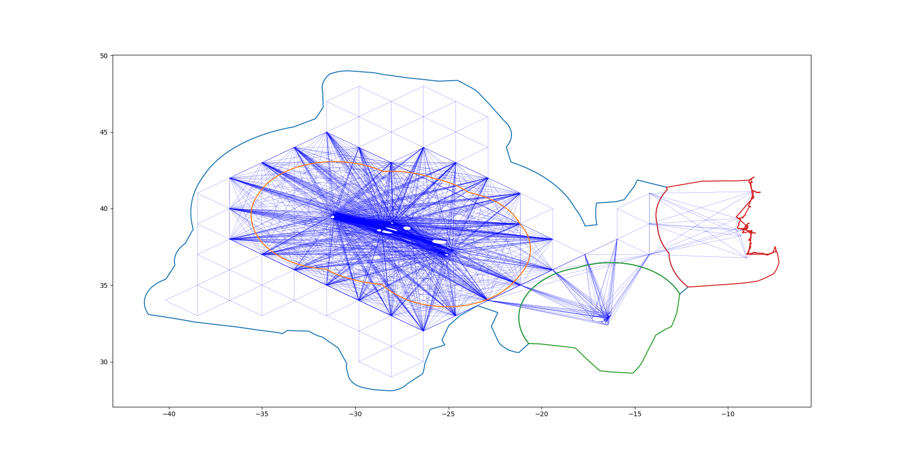

# Project SeaNet
Voronoi-visibility graph of Portugal's Exclusive Economic Zones and proposed Extended Continental Shelf

The purpose of this project was to produce a (prototype demonstrator) tool for the Portuguese Navy to use in deploying Unmanned Surface Vehicles (USV) to patrol the Portuguese maritime territory. Due to the current ambitions of Portugal to expand their maritime assets (Extended Continental Shelf currently pending UN approval) new Navy assets will be required to patrol this greater area. To achieve this goal a fleet of Unmanned Surface Vehicles (USV) can be deployed, potentially minimizing costs, operating in complete autonomy under the watchful eye of the Portuguese Navy.

Unfortunately, as this was nothing more than a personal project while on summer break from my graduate degree, and the time had come to start working on my master's thesis, i was unable to proceed with it farther from the creation of the graph that would serve as the map for the USV fleet to navigate the territory. As such one could certainly say I came very short of the final objective.

Presented here is all the code developed to create the graph that spans the whole current maritime territory of Portugal, this includes the Exclusive Economic Zones of Portugal's Mainland, Azores, Madeira and the proposed (to the EU) Extended Continental Shelf that connects all the aforementioned EEZs (Exclusive Economic  Zones)

In the EEZs, a Visibility graph was implemented. Madeira and Azores are composed of several islands and the respective EEZs extend from these bodies of land, thus to safely and efficiently navigate these zones a visibility graph was implemented. For the ECS (Extended Continental Shelf) a Voronoy graph was used as this area was assumed to be devoid of bodies of land and thus safe to navigate anywhere within. Several equidistant points were defined on this zone and connected to form a graph. Finally in the EEZ of Portugal's main land several ports in its shores where selected and connected to points in the adjacent face of the ECS. In that regard it is worth mentioning that the same was done for several main ports in Azores and Madeira to allow the USVs to travel to a relatively small distance of these ports where then a different navigation system would be used to safely bring the USVs to port.

In the "DataSources" folder above we have all the data containing the coordinates that delimit each of the EEZs and the ECS zone. The "Code" folder has all the python code written to produce the graph that lies over and connects all the zones. Finally the "OutputFiles" folder has all the (intermediate) files produced to culminate in the final graph.
Several other files are present beyond the folders seen. The "ECSgraph.png" shows the vertices of the Voronoy graph defined in the ECS zone along with the ECS zone itself. The "PTgraph.png" shows the complete final graph along with the lines delimiting each EEZ and ECS zones for a more meaningful visualization.

The "Project SeaNet.docx" word file contain all the preliminary requirements, ideas and features I wanted to implement and develop. Finally the "Schedule.docx" is a little schedule (template) made to try and advance the project in a timely manner, it's a nice template that you might be interested in having and comes from the Google Data Analytics Course on Coursera, something you might be interested in having and using.
